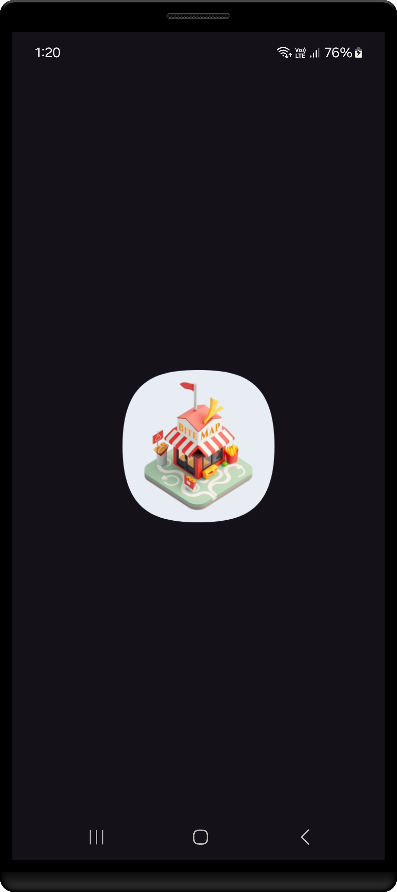
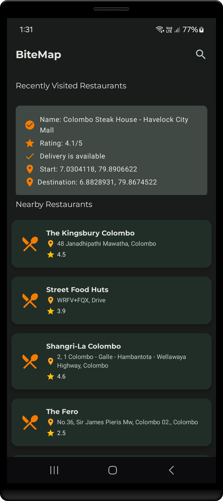
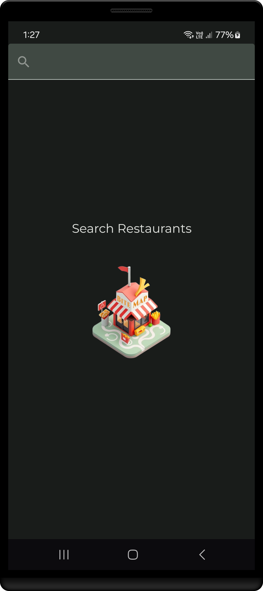
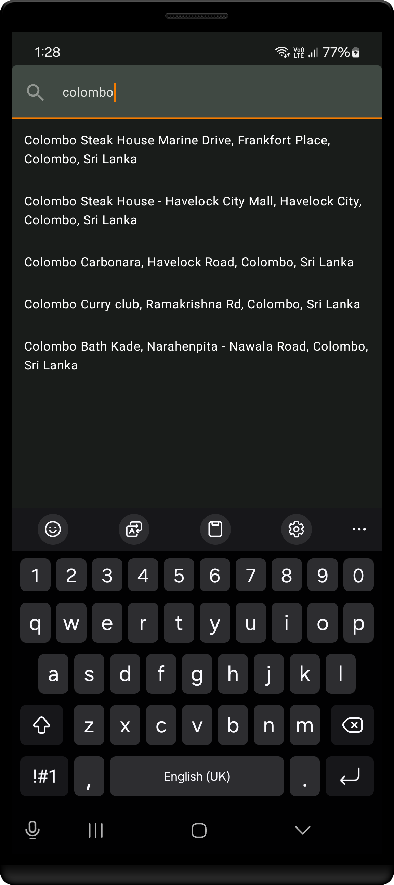
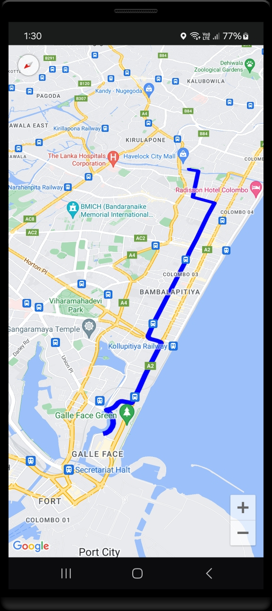
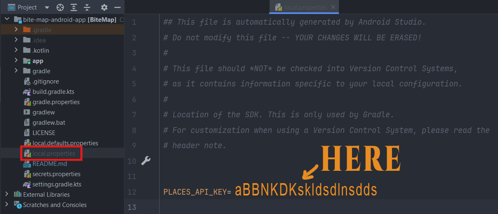

<h1 align="center" >  
BiteMap  <br> ♨ [ ᴀɴᴅʀᴏɪᴅ  ᴘʀᴏᴊᴇᴄᴛ ] ♨
</h1>

🛠️📚 **This is a learning focused project to explore Kotlin's functionality and modular architecture in app development** 🛠️📚

<br/>

## ɪ  ⁃  ᴘʀᴏᴊᴇᴄᴛ ɪɴꜰᴏ

BiteMap is an Android app designed to simplify your dining experience by helping you discover nearby restaurants and navigate to them effortlessly. With just a tap, the app displays a list of nearby eateries, and selecting one opens Google Maps to guide you directly to your chosen destination. The app also includes a powerful search feature to find specific places with ease.

> [!Note]
> **This app is intended for educational purposes, showcasing the capabilities of the Kotlin programming language. It provides insights into how large-scale, complex applications are structured, particularly through modular architecture. In this project, separate packages are used to represent modules, offering a clear example of how to organize and categorize components in a scalable application.**
#

<div align="center">

[](#)
[](#)

[](#)
[](#)
[](#)
[](#)
[](./LICENSE)

</div>

<br/>
<br/>

<p align="center">





</p>

---

### ⭓ Features

- **Nearby Restaurants**: Instantly discover all nearby restaurants with just a tap.
- **Google Maps Integration**: Get directions to your chosen restaurant directly through Google Maps.
- **Search Feature**: Easily search for specific restaurants or cuisines.
- **User-Friendly Design**: Simple and intuitive interface for seamless navigation.

##
### ⭓ Requirements
- Android 7.0 and Above
- Min SDK version 24

##
### ⭓ Permissions
- Location
- Internet

<br>  

---


## ⭓ Important Note ⭓

To run this project, you need a **Google Maps API key**.
Follow the steps below to retrieve your API key and add it to your `local.properties` file. Without this, the app will not function properly.


---

### ⭓ Steps to Retrieve Google Maps API Key

1. **Go to Google Cloud Console**:
    - Visit Google Cloud Console :  
    ```https://console.cloud.google.com/```
   
    - Sign in with your Google account.

2. **Create a New Project (if needed)**:
    - Click on the project dropdown at the top of the page.
    - Select "New Project" and follow the prompts to create a new project.

3. **Enable Required APIs**:
    - In the left sidebar, go to **APIs & Services > Library**.
    - Search for and enable the following APIs:
        - **Maps SDK for Android**
        - **Places API** (for restaurant search functionality)

4. **Create API Key**:
    - In the left sidebar, go to **APIs & Services > Credentials**.
    - Click **Create Credentials** and select **API Key**.
    - Copy the generated API key.

5. **Restrict API Key (Optional but Recommended)**:
    - Click on the API key you just created.
    - Under **Application restrictions**, select **Android apps**.
    - Add your app’s package name and SHA-1 fingerprint (found in your app’s `build.gradle` or via the `keytool` command).
    - Under **API restrictions**, restrict the key to **Maps SDK for Android** and **Places API**.

---

### ⭓ Steps to Add API Key to `local.properties`

1. **Open Your Project**:
    - Open your Android project in Android Studio.

2. **Locate `local.properties`**:
    - In the project view, find the `local.properties` file (usually in the root directory).

3. **Add the API Key**:
    - Add the following line to the file:
      ```properties  
      PLACES_API_KEY=YOUR_API_KEY_HERE  
      ```  
    - Replace `YOUR_API_KEY_HERE` with the API key you copied earlier.

<div align="center">

</div>

<br/>

That's all, 
once the API key is added, the app will work as expected.

<br/>

#

